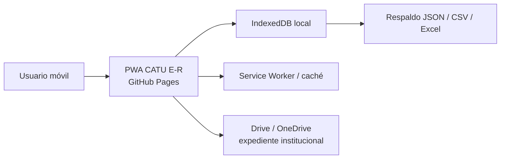
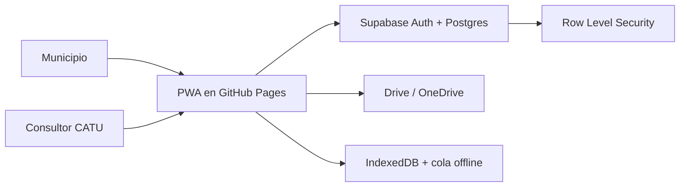

# Arquitectura técnica y modelo de datos — PWA CATU E-R

## 1. Decisión de arquitectura

La estrategia se divide en dos niveles para preservar la naturaleza ligera del producto.

### Nivel A — Piloto GitHub Pages (implementado)

Características:

- sin backend;
- sin build step;
- offline parcial;
- datos locales;
- enlaces a repositorios documentales institucionales;
- cinco perfiles para probar permisos de interfaz;
- máximo operativo local: 25 perfiles.

### Nivel B — Multiusuario ligero (siguiente iteración)

La PWA continúa estática. Supabase se utiliza exclusivamente para autenticación y sincronización de datos estructurados; no para almacenar expedientes municipales.

## 2. Por qué GitHub Pages + vanilla JS

- Reduce mantenimiento y dependencia de desarrollador.
- No requiere servidor web propio.
- HTTPS incluido, condición necesaria para service workers/PWA.
- Permite auditar el código fuente.
- Facilita trabajo con Codex/GitHub posteriormente.
- Evita que React/Vue/Angular y su cadena de compilación se conviertan en una dependencia prematura.

La decisión puede revisarse si el modo Entrante o la integración documental justifican un framework.

## 3. Modelo lógico de datos

### Workspace

Representa un municipio/cliente CATU.

- `id`
- `municipality`
- `state`
- `outgoing_period`
- `incoming_period`
- `baseline_date`
- `r086_state`
- `max_users`
- `notes`

### ControlMaster

Catálogo inmutable/versionado derivado de C2.

- `id` (`R001…R086`)
- `macro_module`
- `module`
- `foundation_validated`
- `requirement`
- `evidence_minimum`
- `validation_criteria`
- `responsible_base`
- `milestone`
- `base_risk`
- `phase2_verdict`
- `applicability_2027`
- `legal_certainty`

### Assessment

Estado de un control para un workspace.

- `workspace_id`
- `control_id`
- `status`
- `evidence_status`
- `scenario`
- `route`
- `responsible`
- `due_date`
- `progress`
- `residual_risk`
- `evidence_link`
- `notes`
- `oic_validation`
- `evaluated_at`
- `evaluator_user_id`
- `closed_at`

### EvidenceReference

- `id`
- `workspace_id`
- `control_id`
- `description`
- `external_url`
- `photo_reference` — sólo si se autoriza en la arquitectura productiva
- `document_date`
- `integrity`
- `verified`
- `verified_by`
- `verified_at`

### UserProfile

- `id`
- `workspace_id`
- `name`
- `email`
- `role`
- `area`
- `active`

Roles permitidos:

`admin | coordinator | area | oic | catu`

### AuditLog

- `id`
- `workspace_id`
- `user_id`
- `event_type`
- `control_id`
- `created_at`
- `summary`

## 4. Reglas de autorización propuestas para producción

| Operación | ADM | COOR | AREA | OIC | CATU |
|---|---:|---:|---:|---:|---:|
| Ver dashboard | ✓ | ✓ | ✓ | ✓ | ✓ |
| Editar diagnóstico | ✓ | ✓ | Ámbito asignado | Sólo observación | ✓/supervisión |
| Registrar evidencia | ✓ | ✓ | Ámbito asignado | ✓ | ✓ |
| Validar cierre OIC | — | — | — | ✓ | — |
| Administrar usuarios | ✓ | ✓ limitado | — | — | ✓ consultoría |
| Configurar pesos IPER | ✓ restringido | — | — | consulta | ✓ |
| Exportar reporte | ✓ | ✓ | ámbito | ✓ | ✓ |

En producción, la autorización debe vivir en RLS/backend, no sólo en botones del frontend.

## 5. Estrategia de offline parcial

### Piloto

IndexedDB conserva:

- workspace;
- perfiles locales;
- evaluaciones;
- evidencias referenciales;
- fotografías comprimidas locales opcionales;
- bitácora.

Service Worker conserva:

- HTML/CSS/JS;
- manifest;
- iconos;
- catálogo de controles.

### Multiusuario

Se agregaría una `sync_queue` local:

- crear/editar localmente;
- marcar operación `pending`;
- sincronizar al recuperar conectividad;
- resolver conflictos por `updated_at` + estrategia de revisión cuando el mismo control fue modificado en dos equipos.

Para mantener simplicidad se recomienda **no** habilitar edición simultánea del mismo control por varios usuarios durante la primera Beta multiusuario.

## 6. Seguridad y privacidad

1. El repositorio GitHub no contiene datos de municipios.
2. Los expedientes oficiales continúan en Drive/OneDrive.
3. La PWA almacena sólo metadatos, links y estado operativo.
4. Un enlace externo nunca debe ampliar por sí mismo los permisos del expediente.
5. En Supabase, todas las tablas con datos de clientes requieren RLS por `workspace_id`.
6. La clave `service_role` de Supabase nunca debe llegar al navegador.
7. El perfil CATU sólo debe acceder a workspaces contratados/asignados.
8. No almacenar contraseñas personales, firmas biométricas ni documentos de identidad en la PWA.

## 7. Estrategia de evolución

### v0.1 — Piloto local

Implementada en este repositorio.

### v0.2 — Beta multiusuario

- Supabase Auth.
- RLS.
- espacios municipales independientes;
- 25 usuarios por workspace como límite comercial inicial;
- sync de Assessment/EvidenceReference/AuditLog;
- sin archivos binarios.

### v0.3 — Operación consultoría

- invitaciones por correo;
- tablero CATU multicliente;
- versiones de baseline normativa;
- reportes de corte histórico;
- plantillas de cédulas de diferencias.

### v1.0 — Producto estabilizado

Sólo después de piloto, revalidación normativa 2027, pruebas móviles, revisión de seguridad y calibración IPER.
